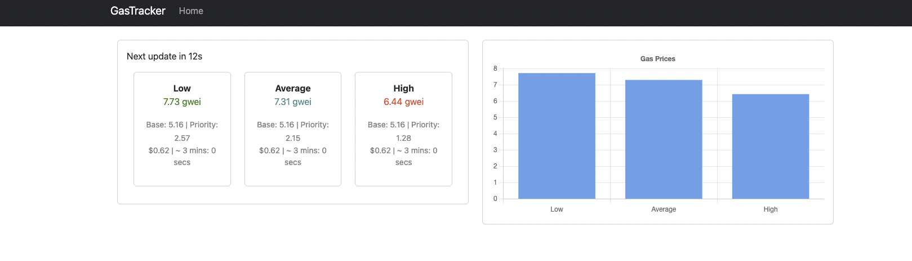

# Gas Tracker

Simple ***gas-tracker*** to show estimated **Ethereum gas price** in a beatiful way.

## Requirements

- Node v18.9.0
- npm 8.19.1

## Installation

```bash
npm install
```

## Installation

```bash
npm start
```

## Screenshots

Below you see two different statistics table. The right one is dummy, don't show values as expected for now. The left one shows estimated gas prices according to waiting time.
- ***Low*** specifies that you won't wait for long time
- ***Average*** specifies that you may wait for some time
- ***High*** specifies that you will probably wait for a long time

